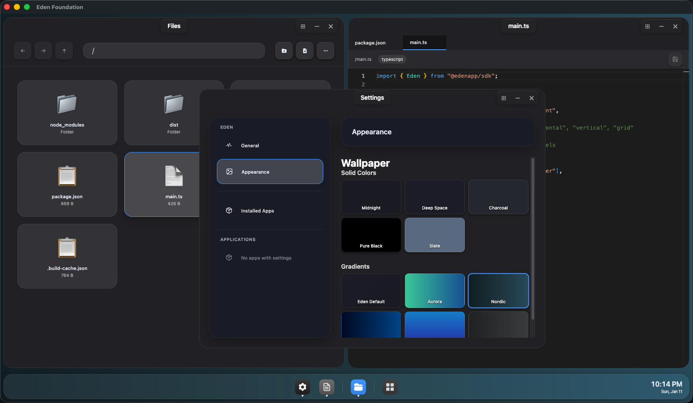

# 🌿 Eden Desktop Environment

> A modern, modular desktop environment framework built on Electron. Create beautiful, tiled desktop experiences with a powerful app ecosystem.

[](LICENSE)

## ✨ Overview

Eden is a complete desktop environment SDK that lets you build custom desktop experiences with a focus on modularity, security, and developer experience. It provides window management with tiling support, a robust IPC architecture, and a beautiful design system out of the box.



## 🚀 Best Features

- **🪟 Window Management** - Tiling window manager (horizontal, vertical, grid) with floating window support
- **🔌 Three-Layer IPC** - EdenAPI (system ops), AppAPI (frontend↔backend), AppBus (app-to-app communication)
- **🎨 EdenCSS Design System** - Glassmorphism UI with dark theme, component library, and design tokens
- **🎯 Built-in Apps** - File manager, editor, settings, launcher, browser, calculator, and more
- **💾 Data Management** - Per-app SQLite databases, persistent settings, and file associations
- **👤 User Management** - Multi-user support with roles (vendor/standard), login/logout sessions, password management
- **🔑 Grants & Access Control** - Fine-grained per-user grants with glob matching, app-level feature grants, and restricted app enforcement
- **🌍 Internationalization (i18n)** - Full localization framework with typed translations, interpolation support, reactive locale switching, and localized app manifests

## 📖 Quick Start

### Installation

```bash
# Clone the repository
git clone https://github.com/yourusername/eden.git
cd eden

# Install dependencies
pnpm install

# Build all packages
pnpm build
```

### Running the Example

```bash
# Run the example desktop environment
pnpm dev
```

This will build and launch the example Eden desktop environment with hot reload enabled.

### Building an App

An Eden app is a web application (frontend-only or full-stack with Node.js backend) that runs within the Eden desktop environment. Apps are defined by a `manifest.json` file and can be packaged into `.edenite` archives.

```bash
# Using Genesis bundler
genesis build ./my-app -o ./dist/my-app.edenite
```

## 📚 Documentation

- **[App Development Guide](docs/app-development.md)**: Learn how to build Eden apps
- **[IPC Architecture](docs/ipc-architecture.md)**: Deep dive into Eden's IPC system
- **[Localizing Apps](docs/localizing-apps.md)**: Add i18n support to your Eden app
- **[User Management](docs/users.md)**: Users, roles, grants, and sessions
- **[Genesis README](packages/genesis/README.md)**: App bundling and packaging
- **[EdenCSS Documentation](packages/sdk/edencss/README.md)**: Design system reference

## 📝 License

MIT License - see [LICENSE](LICENSE) file for details.
