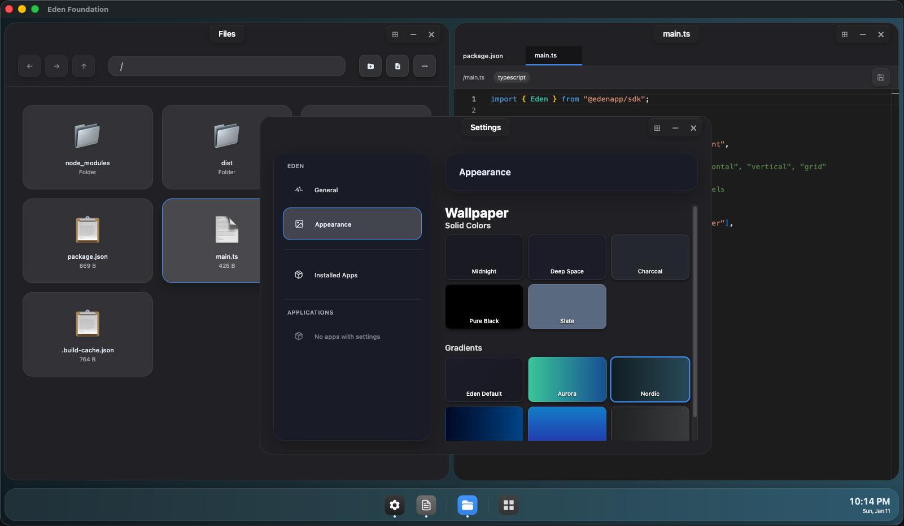

<div align="center">

# Eden

### An operating environment for building your own operating environment.

Eden turns Electron into a modular desktop: sandboxed apps, tiled and floating
windows, system services, permissions, theming, and app-to-app communication—
without making every product rebuild the shell from scratch.

[Get started](#run-eden) · [Build an app](#build-for-eden) · [Read the docs](#documentation)

[](LICENSE)
[](https://www.electronjs.org/)
[](https://www.typescriptlang.org/)

</div>



## A desktop is more than a window

Eden provides the machinery behind an OS-like product experience. Applications
run in isolated `WebContentsView`s and ask the shell for access to files,
databases, processes, notifications, and other system resources. The host stays
in control through explicit manifests, capabilities, and per-user grants.

Out of the box, Eden gives you:

- **A real windowing model** — tiled, floating, and overlay views managed by the shell.
- **Sandboxed applications** — frontend-only apps, full-stack apps, and background daemons.
- **Three purposeful communication layers** — system commands, frontend/backend messaging, and cross-app services.
- **EdenCSS** — injected design tokens, utilities, and components that make apps feel native to the environment.
- **A configurable product shell** — users, sessions, localization, branding, file associations, and provider-based system capabilities.
- **A working app ecosystem** — files, settings, editor, calculator, process manager, PDF viewer, and more.
- **Portable app bundles** — package and distribute applications as `.edenite` archives with Genesis.

## Run Eden

You will need Git, Node.js, and [pnpm](https://pnpm.io/).

```bash
git clone https://github.com/b0czek/eden.git
cd eden
corepack enable
pnpm install
pnpm dev
```

`pnpm dev` builds the SDK and starts its development host with watch mode. To
launch the separate consumer example instead:

```bash
pnpm dev:example
```

Useful workspace commands:

```bash
pnpm build       # build publishable workspace packages
pnpm test        # run unit and Node integration suites
pnpm typecheck   # type-check the workspace
pnpm lint        # run Biome checks
```

## Build for Eden

An Eden app is a web app with a manifest. It can have only a frontend, pair that
frontend with a Node.js backend, or run headlessly as a daemon.

```text
my-app/
├── manifest.json
├── package.json
└── src/
    └── index.tsx
```

The manifest declares what the app is, how it opens, and which capabilities it
needs:

```json
{
  "id": "com.example.notes",
  "name": "Notes",
  "version": "1.0.0",
  "icon": "icon.svg",
  "frontend": {
    "entry": "dist/index.html"
  },
  "window": {
    "mode": "both",
    "defaultMode": "floating",
    "defaultSize": { "width": 900, "height": 640 }
  },
  "permissions": ["fs/*", "db/rw"]
}
```

Inside the sandbox, apps interact with Eden through APIs injected by the host:

```ts
const documents = await window.edenAPI.shellCommand("fs/readdir", {
  path: "/Documents",
});
```

When it is ready to ship, Genesis turns the app into a portable bundle:

```bash
genesis build ./my-app -o ./dist/my-app.edenite
```

See the [app development guide](docs/app-development.md) for manifests,
permissions, backends, standalone development, and packaging.

## The model

```text
Your Electron product
└── new Eden({ branding, apps, users, windowing, ... })
    │
    ├── Foundation
    │   └── the host window and workspace behind every app
    │
    ├── Eden runtime
    │   ├── packages and processes
    │   ├── views and tiling
    │   ├── users, sessions, permissions, and settings
    │   └── files, associations, notifications, and services
    │
    └── Applications
        ├── frontend-only ───── sandboxed WebContentsView
        ├── frontend + backend ─ WebContentsView + utility process
        └── daemon ───────────── backend without a frontend
```

Eden is an SDK embedded by a consumer Electron application, not a collection of
pages wrapped in a shell. The consumer decides the product configuration and
ships a set of built-in or packaged apps. Eden owns their lifecycle and gives
them controlled access to the host through EdenAPI, AppAPI, and AppBus.

Genesis sits on the build side of this model: it turns app source into the
`.edenite` packages that the runtime installs and launches.

| Package | Role |
| --- | --- |
| [`@edenapp/sdk`](packages/sdk) | Desktop runtime, shell services, built-in apps, and EdenCSS |
| [`@edenapp/genesis`](packages/genesis) | Builds and packages `.edenite` applications |
| [`@edenapp/types`](packages/types) | Shared contracts for apps, manifests, and the host |
| [`@edenapp/solid-kit`](packages/solid-kit) | SolidJS helpers for Eden applications |
| [`@edenapp/example`](packages/example) | Minimal consumer implementation |

## Documentation

- [App development](docs/app-development.md) — app structure, manifests, permissions, and development
- [Filesystem access](docs/filesystem.md) — virtual paths, file commands, and directory watching
- [IPC architecture](docs/ipc-architecture.md) — EdenAPI, AppAPI, and AppBus
- [Processes and daemons](docs/processes-and-daemons.md) — background work and lifecycle
- [Settings](docs/settings.md) — adding host and app settings
- [Localization](docs/localizing-apps.md) — typed translations and reactive locale changes
- [Users and grants](docs/users.md) — accounts, roles, sessions, and access control
- [Consumer branding](docs/branding.md) — product name, login artwork, and window icons
- [Host power management](docs/power-management.md) — typed restart and power-off integration
- [Contributor testing](docs/testing.md) — unit, integration, Electron, and CI checks
- [EdenCSS](packages/sdk/edencss/README.md) — tokens, utilities, and components
- [Genesis](packages/genesis/README.md) — application bundling and `.edenite` internals

## License

Eden is available under the [MIT License](LICENSE).
